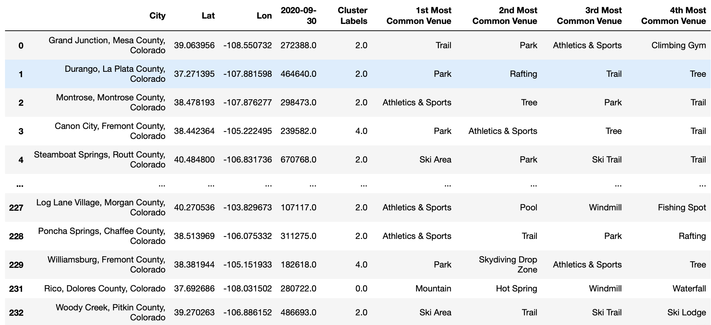
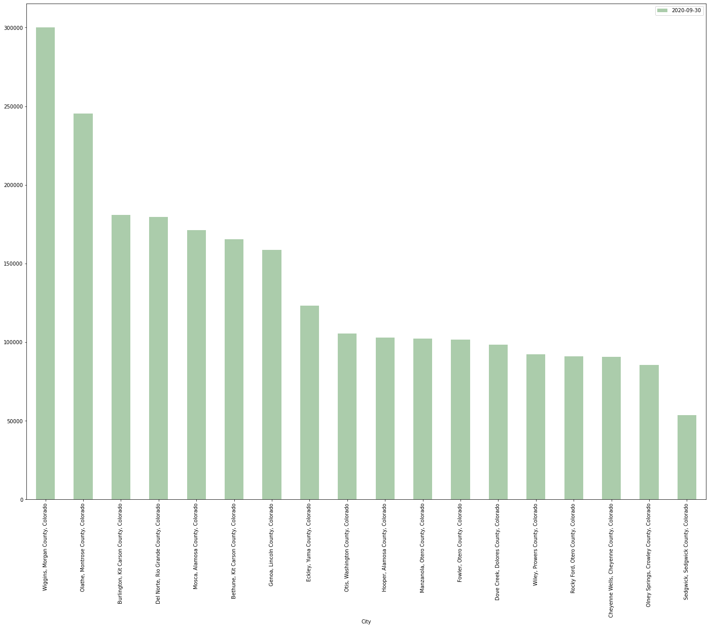
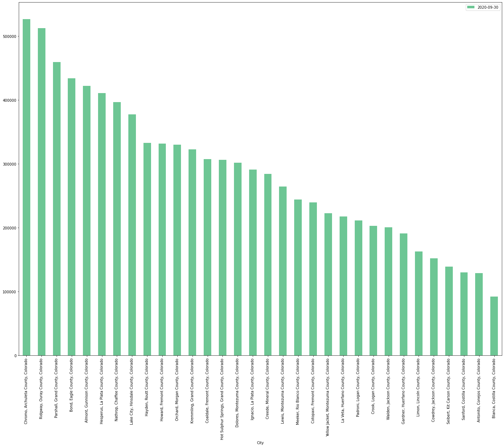
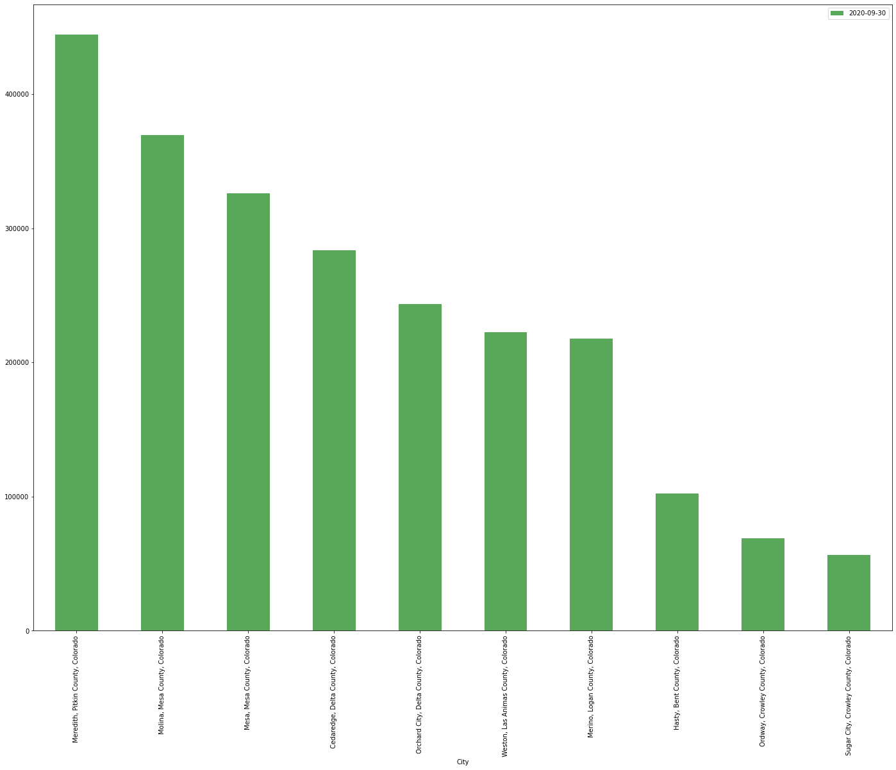

## Final Project Overview
### Opportunity Statement

The Covid pandemic resulted in a greatly renewed interest in nature & outdoor activities, due to safety issues and restrictions placed on typical indoor attractions in urban areas.

The Google Trends data below shows the enormous spike in searches for "Outdoor Activities" in the US in 2020 compared to the preceeding 5 years.

While one can assume some return closer to pre-pandemic baselines once the pandemic is addressed, interest in outdoor-oriented vacations/remote work can reasonably be expected to remain at a higher level than they were pre-pandemic, leading to continued opportunity in vacation rental housing in these markets with an abundance of options. This is likely to be complimented by the increasing acceptance of remote work, given office closures throughout 2020, potentially creating a larger market for work/leisure travel, increasing the potential weeks Americans could travel without requiring vacation days.

This project will attempt to assist an investor attempting to take advantage of this renewed interest in outdoor experience, by identifying smaller rural cities and towns with an abundance of outdoor activity and stable housing values to investigate an investment in a vacation rental home to list on the prominent rental platforms (Airbnb/VRBO/etc).

My datasets will leverage the [Foursquare Places API](https://developer.foursquare.com/docs/places-api/) to identify outdoor places and the [Zillow Home Values Forecast (City Admin Level)](https://www.zillow.com/research/data/) to identify home value trends in these areas.  

I will then cluster the data using K-Means Clustering to identify ideal markets for a potential investment into a vacation rental home.  The goal is to identify clusters of potentially undervalued markets from a housing investment perspective to identify cities with future growth potential for a housing investment.

### Data Source Examples
#### Zillow Home Values Forecast Data
Zillow Home Value Index (ZHVI): A smoothed, seasonally adjusted measure of the typical home value and market changes across a given region and housing type. It reflects the typical value for homes in the 35th to 65th percentile range

The csv file can be retrieved in the csv folder to review the data.

#### Foursquare Places API
The Foursquare Places API will be used to identify Outdoor opportunities leveraging the 'Outdoors & Recreation' Category ID.  The output below shows some samples of how the foursquare app could be utilized.
``json
'meta': {'code': 200, 'requestId': '5fd44a674fe037099c612345'},
 'response': {'venues': [{'id': '51e30b94498e535deccfdea5',
    'name': 'Mt. Sneffels Trail Head',
    'location': {'lat': 38.02182290933693,
     'lng': -107.6715202730119,
     'labeledLatLngs': [{'label': 'display',
       'lat': 38.02182290933693,
       'lng': -107.6715202730119}],
     'distance': 267,
     'cc': 'US',
     'state': 'Colorado',
     'country': 'United States',
     'formattedAddress': ['Colorado', 'United States']},
    'categories': [{'id': '4bf58dd8d48988d159941735',
      'name': 'Trail',
      'pluralName': 'Trails',
      'shortName': 'Trail',
      'icon': {'prefix': 'https://ss3.4sqi.net/img/categories_v2/parks_outdoors/hikingtrail_',
       'suffix': '.png'},
      'primary': True}],
    'referralId': 'v-1607748199',
    'hasPerk': False},
   {'id': '55ef161d49``

Note that while I will make calls leveraging the 'Outdoors & Recreation' Category ID, this includes many indoor venue types that I am not interested in.  After making the api call, I will remove the following:

>'Gym', 'Gym / Fitness Center', 'Dog Run', 'Yoga Studio', 'Playground', 'Indoor Play Area', 'Recreation Center', 'Baseball Field','Weight Loss Center', 'Gun Range', 'Skate Park', 'Golf Driving Range', 'Golf Course', 'Pilates Studio', 'Soccer Field', 'Gym Pool', 'Martial Arts School', 'Boxing Gym', 'Basketball Court', 'Tennis Court', 'Track', 'Gymnastics Gym', 'Hockey Field'

### Methodology
In this project I used One Hot Encoding to normalize the retrieved venues then KMeans Clustering to group the cities
by density of Outdoor/Recreation venue types to identify potential cities with similar outdoor opportunities as the most well-known Colorado cities

After some experimentation, I settled on using 8 Clusters, as this provided sufficient differentiation by Venue Category to identify additional cities for future research.

The below map shows the geographic distribution of cities in my evaluation color coded by the cluster they fall within:

I then merged this data with the Zillow Home Value Index (using the September '20 values) to identify median home values in each city to target cities for further research.

### Results
This approach yielded a few clusters worth investigating deeper in identifying potential candidate cities.

Cluster 2 would be my primary Target Cluster, as this cluster contains cities most associated with Outdoor Recreational opportunities in Colorado. The Ski resort towns like Breckenridge, Vail, Aspen, and Telluride, in addition to adjacent towns like Ouray or Montrose. The high variation in house forecast values shows that cities in the lower end of the housing value distribution may are worth targetting for additional research for vacation rental investment homes.

__Cluster 2 Map__

__Cluster 2 Median Housing Values__

#### Additional Clusters and Housing Value Distribution below
##### Cluster 0

##### Cluster 1

##### Cluster 3

##### Cluster 4

##### Cluster 5

##### Cluster 6

##### Cluster 7

### Discussion
The problem I attempted to solve was to identify potentially undervalued cities for real estate investment to take advantage of the increased interest in outdoor recreation resulting from COVID.  By focusing on Colorado, I can analyze a fast-growing state with an abundance of small/medium-sized cities near nature.  

The work done thus far already highlighted a set of target cities that may be worthy of investment now. Of course, the work done to cluster thus far is really still in the beginning stage of analysis.  Having gotten to this point, there are a number of paths I would like to take to improve this further which I will discuss in the next section.

That said, this series of courses has given me the ability to recognize how easy it is to leverage some common machine learning algorithms into many common business problems.

### Conclusion

In this project I narrowed down cities for a potential vacation housing investment by clustering like properties by the distribution of their outdoor amenties.  While I believe I have satisfied the requirements for the project, there are a number of additional steps I would like to take to further drill into optimal cities for such an investment. Some additional approaches may be to incorporate:

- Perform Linear Regression on ZHVI per target city
- Distance from Denver
- Real Estate Price Trends
- Non-outdoor venue density valued by vacationers (bars, cafes, restaurants)
